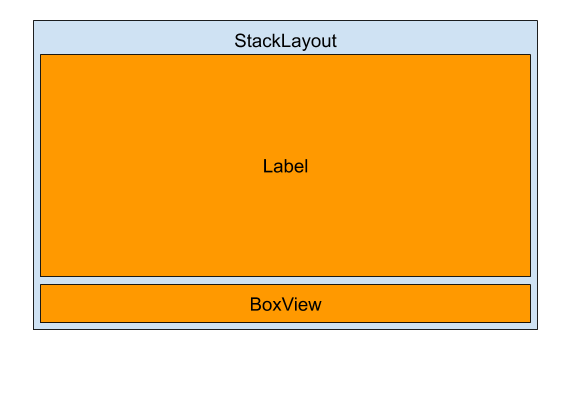

# Create a Custom Control with Xamarin.Forms

The process of building UI elements requires, at some point, some customizations to give the unique feel and look to the application and to extend the functionality of existing controls. Whether the customization is just overriding the default [`TextColor`](xref:Xamarin.Forms.Entry.TextColor) of the [`Entry`](xref:Xamarin.Forms.Entry) control, or creating a brand new control with new look and behavior, building custom controls can provide the simple solution to achieve that, without the need of custom renderers.

## Create a Custom ProgressBar Control

The `ProgressBar` control can be used to show a progress. Although Xamarin.Forms comes with [`ProgressBar`](xref:Xamarin.Forms.ProgressBar) control already, you might need a more sophisticated control, for example, for an application feature based on progressing on some task.
The custom `ProgressBar` control uses animation while progressing, it exposes some bindable properties that determine the control look.

Bindable properties are the foundation of custom controls (For more information about Xamarin.Forms bindable properties, see [Xamarin.Forms Bindable Properties](~/xamarin-forms/xaml/bindable-properties.md)).

The process for creating custom controls is as follows:

1. [Create](#Create_Subclass_of_the_View_You_Want_To_Extend) a subclass of the view you want to extend or modify.
2. [Alter](#Alter_the_Functionality_of_the_Subclass) the functionality of the subclass by overriding the default values of the base class’s bindable properties and/or create new bindable properties that will interact with user actions.
3. [Initialize](initializing_the_custom_control) the custom control.
4. [Process](#Process_Inputs_in_Run_Time) inputs in run-time through the `propertyChanged` delegate of the newly added bindable properties.

<a name="Create_Subclass_of_the_View_You_Want_To_Extend" />

## Create a Subclass of the View you Want to Extend

Most of custom controls are hosted in a `ContentView` as it is the simplest container and doesn't expose special properties (like `Orientation` of the `StackLayout` that may be interfer with the the control behavior).
Create a subclass from `ContentView` in the .NET Standard library project, name it `CustomProgressBar`, it holds the `StackLayout` that has two children: [`Label`](xref:Xamarin.Forms.Label) and [`BoxView`](xref:Xamarin.Forms.BoxView), the following diagram illustrates the control outline:



When the `StackLayout` is tapped, the selection state is mutated. The visual state is defined by the [`TextColor`](xref:Xamarin.Forms.Label.TextColor) property of the `Label` and the [`Color`](xref:Xamarin.Forms.BoxView.Color) property of the `BoxView`.

<a name="Alter_the_Functionality_of_the_Subclass" />

## Alter the Functionality of the Subclass

Create the bindable properties: `IsSelected`, `SelectedColor`, `UnselectedColor`, `Text`, `FontFamily` and `FontSize`. This is the `SelectedColor` property along with the [`BindableProperty`](xref:Xamarin.Forms.BindableProperty) backing field:

```csharp
public static readonly BindableProperty SelectedColorProperty = BindableProperty.Create(nameof(SelectedColor), typeof(Color), typeof(ToggleButton),
defaultValue: Color.Default);

 public Color SelectedColor
 {
     get { return (Color)GetValue(SelectedColorProperty); }
     set { SetValue(SelectedColorProperty, value); }
 }
 ```
 
> [!NOTE]
> A bindable property is a special type of property, where the property's value is tracked by the Xamarin.Forms property system. 
> The purpose of bindable properties is to provide a property system that supports data binding, styles, templates, and values set through
> parent-child relationships.
The process of creating a bindable property is as follows:
> 1. Create a [`BindableProperty`](xref:Xamarin.Forms.BindableProperty) instance with one of the [`BindableProperty.Create`](xref:Xamarin.Forms.BindableProperty.Create*) method overloads.
> 2. Define property accessors for the [`BindableProperty`](xref:Xamarin.Forms.BindableProperty) instance.
>   
> For more information about Xamarin.Forms bindable properties, see [Xamarin.Forms Bindable Properties
> ](~/xamarin-forms/xaml/bindable-properties.md)

> [!NOTE]
> Custom bindable properties in custom controls can be categorized into two types:
> 1. Bindable properties that are passed down to the built-in bindable properties of child elements, like `Text` bindable property of the `ToggleButton` custom control, that is passed down to the `Text` bindable property of the `Label` control.
> 2. Bindable properties that are specific to the custom control itself and not owned exclusively by any of the child elements, like the `IsSelected` bindable property. The more behavioral customization required to the custom control, the more of these bindable properties are needed.

<a name="initializing_the_custom_control" />

## Initializing the custom control

In the constructor of the `ToggleButton` class, initialize the inner controls and create the bindings between the new properties of the custom control and the properties of the inner controls (i.e., the StackLayout, the Label and the BoxView):
```csharp
public ToggleButton()
{
    verticalStack = new StackLayout
    {
        Spacing = 0,
        HorizontalOptions = LayoutOptions.FillAndExpand
    };
    label = new Label
    {
        HorizontalTextAlignment = TextAlignment.Center,
        VerticalTextAlignment = TextAlignment.Center,
        VerticalOptions = LayoutOptions.CenterAndExpand,
        Margin = new Thickness(5)
    };
    boxView = new BoxView
    {
        VerticalOptions = LayoutOptions.End,
        HeightRequest = HeightRequest > 0 ? HeightRequest / 10d : 2
    };

    label.SetBinding(Label.TextColorProperty, new Binding(nameof(UnselectedColor), source: this));
    label.SetBinding(Label.TextProperty, new Binding(nameof(Text), source: this));
    label.SetBinding(Label.BackgroundColorProperty, new Binding(nameof(BackgroundColor), source: verticalStack));
    label.SetBinding(Label.WidthRequestProperty, new Binding(nameof(WidthRequest), source: verticalStack));
    label.SetBinding(Label.HeightRequestProperty, new Binding(nameof(HeightRequest), source: verticalStack));
    label.SetBinding(Label.FontFamilyProperty, new Binding(nameof(FontFamily), source: this));
    label.SetBinding(Label.FontSizeProperty, new Binding(nameof(FontSize), source: this));
    boxView.SetBinding(BoxView.BackgroundColorProperty, new Binding(nameof(BackgroundColor), source: verticalStack));
    verticalStack.GestureRecognizers.Add(new TapGestureRecognizer()
    {
        Command = new Command(() =>
        {
            IsSelected = !IsSelected;
            SelectionChanged?.Invoke(this, IsSelected);
        })
    });

    verticalStack.Children.Add(label);
    verticalStack.Children.Add(boxView);
    Content = verticalStack;
}
```
The constructor initializes the control properties, for example the `TextColor` property of the `Label` is bound to the `UnselectedColor` property of the custom control beacause the control is rendered in unselected state if `IsSelected` is not set, similarly, the `BoxView`'s `Color` property is bound to the value of the `BackgroundColor` of the `StackLayout` to hide it, it only gets highlited with `SelectedColor` value when the control is selected. Setting the `WidthRequest` and `HeightRequest` for the `Label` and `HeightRequest` for the `BoxView` ensures they scale with the `StackLayout` size.

A [`TapGestureRecognizer`](xref:Xamarin.Forms.TapGestureRecognizer) is added to the `StackLayout`’s `GestureRecognizers` collection to mutate the selection state of the `ToggleButton` when the `StackLayout` is tapped. The `TapGestureRecognizer` provides two approaches for handling the tap action: by the [`Tapped`](xref:Xamarin.Forms.TapGestureRecognizer.Tapped) event, or by the [`Command`](xref:Xamarin.Forms.TapGestureRecognizer.Command) property. For more information about the tap gesture recognizer, see [Adding a tap gesture recognizer](~/xamarin-forms/app-fundamentals/gestures/tap.md). When the value of `IsSelected` propery changes, the `propertyChanged` delegate handles the visual state of the control (see next section).

Create `SelectionChanged` event that gets invoked when the `StackLayout` is tapped, to notify consumers of the `ToggleButton` (e.g. the `ToggleBar` control) when selection changes:

```csharp
public event EventHandler<bool> SelectionChanged;
```

<a name="Process_Inputs_in_Run_Time" />

## Process Inputs in run-time Through the [`propertyChanged`](xref:Xamarin.Forms.BindableProperty.BindingPropertyChangedDelegate) Delegate

Add the [`propertyChanged`](xref:Xamarin.Forms.BindableProperty.BindingPropertyChangedDelegate) parameter to the `BindableProperty.Create` method used to create the `IsSelectedProperty`, and handle it to mutate the visual state of the control based on the `IsSelected` value:
```csharp
public static readonly BindableProperty IsSelectedProperty =
    BindableProperty.Create(nameof(IsSelected), typeof(bool), typeof(ToggleButton), false,
        propertyChanged: (bindable, oldValue, newValue) =>
        {
            ((ToggleButton)bindable).MutateSelect();
        }
    );
        
void MutateSelect()
{
    if (IsSelected)
    {
        button.TextColor = SelectedColor;
        underLine.Color = SelectedColor;
    }
    else
    {
        button.TextColor = UnselectedColor;
        underLine.Color = BackgroundColor;
    }
}
```

## Consuming the Custom Control
The `ToggleButton` control can be referenced in XAML in the .NET Standard library project by declaring a namespace for its location and using the namespace prefix on the control element. The following code example shows how the `ToggleButton` control can be consumed by a XAML page:
```xaml
<ContentPage ...
    xmlns:controls="clr-namespace:CustomControlsSample.CustomControls"
    ...>
    ...
    <controls:ToggleButton x:Name="toggleButton" Text="On" BackgroundColor="Black" UnselectedColor="Gray" SelectedColor="White" SelectionChanged="ToggleButton_SelectionChanged"/>
    ...
</ContentPage>
```
The following code example shows how the `ToggleButton` control can be consumed by a C# page:
```csharp
public class MainPage : ContentPage
{
  public MainPage ()
  {
    var toggleButton = new ToggleButton
    {
       Text = "On",
       BackgroundColor = Color.Black,
       UnselectedColor = Color.Gray,
       SelectedColor = Color.White,
    };
   toggleButton.SelectionChanged += ToggleButton_SelectionChanged;
   Content = toggleButton;
  }
}
```

Attach a handler to the `SelectionChanged` event to handle the selection change in the code-behind file:
```csharp
private async void ToggleButton_SelectionChanged(object sender, EventArgs e)
{
    string message = toggleButton.IsSelected ? "ToggleButton is selected" : "ToggleButton is unselected";
    await DisplayAlert("ToggleButton", message, "OK");
}
```

## Summary

This article has demonstrated how to create a custom control in Xamarin.Forms, enabling developers to create new controls with new look and behavior, in the .NET Standard library project, without creating custom renderers. With the rich set of the [layouts](~/xamarin/xamarin-forms/user-interface/layouts.md) and the [Animation](~/xamarin-forms/user-interface/animation.md) API in Xamarin.Forms, you can even create more sophisticated and appealing controls.

## Related Links

- [Xamarin.Forms Bindable Properties](~/xamarin-forms/xaml/bindable-properties.md)
- [CustomControlsSample (sample)](https://docs.microsoft.com/samples/xamarin/xamarin-forms-samples/CustomControlsSample)
- [Creating Custom Controls with Xamarin Forms](https://www.youtube.com/watch?v=ZViJyL9Ptqg)
